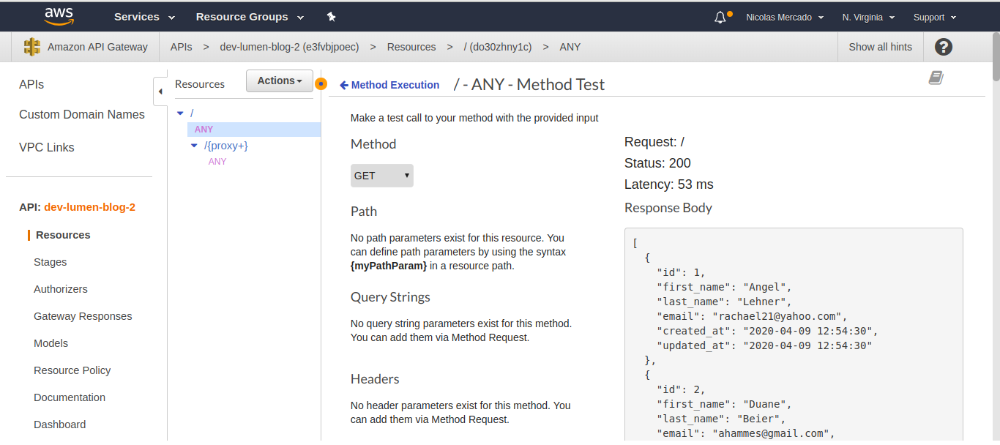
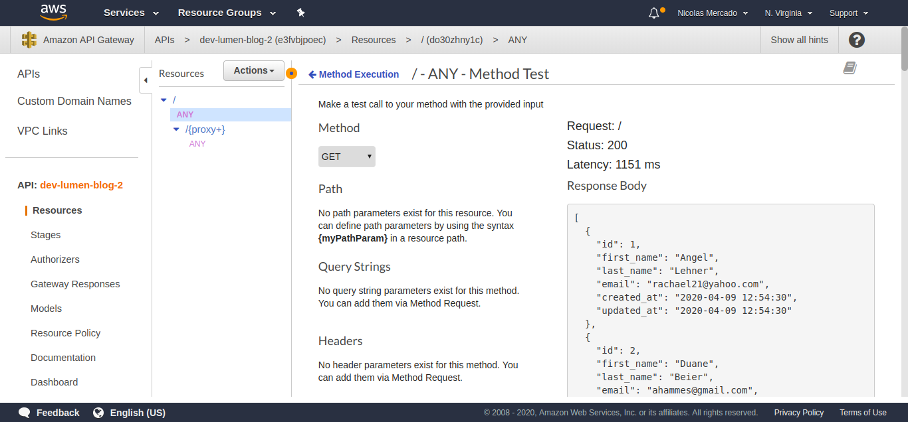
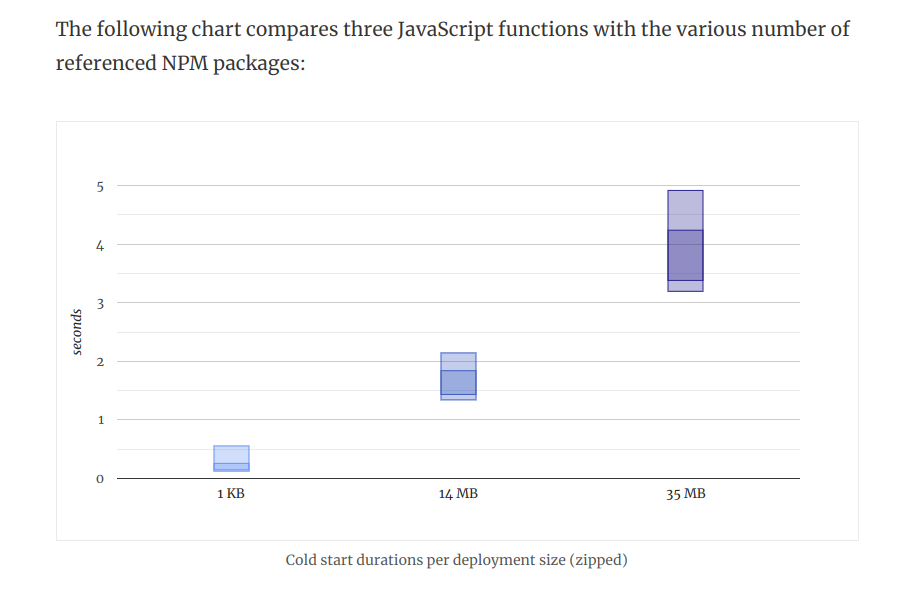

# Lumen Blog example on Bref POC

This is a sample proof-of-context of running the [Laravel/Lumen microframework](https://lumen.laravel.com/) on [Bref](https://bref.sh/).

# Components

The project consists of a simple set of API endpoints that instantiate and interact with an RDS MySQL instance in a VPC.
The example is based on the Serverless framework for easier configuration of the AWS functions and resources, and easier transition to multi-cloud.

# Deploying

- Install the Serverless framework: https://serverless.com/framework/docs/getting-started/
- Clone the repository.
- Configure your SLS API key, or your AWS credentials directly via `aws configure`.
- Execute `sls deploy`.

# Performance

## Warm start

With the container already initialized, latency for a simple endpoint executing a query is consistently < 100ms.

## Cold starts

Latency is > 1 second when performing a cold start. 

Cold starts are a common issue in Lambda architecture and it seems to be more prominent in Bref.

Cold start times seems to have a correlation with packaged runtime size.
Note that, for this Lumen installation, the packaged vendor folder is ~10 MB.
Taking this into account, performance seems comparable to that of NodeJS with same packaged size.

As per benchmark on https://mikhail.io/serverless/coldstarts/aws/

Note that Lumen already comes with much of the Laravel tooling, which makes it less likely to require extra packages in comparison to other skinned down
frameworks like Slim, or ExpressJS. Included functionality:

- Eloquent ORM
- Mailers
- Queues
- Cache (redis/memcached)
- Encryption
- Validation
- Dependency injection
- Logging

Solutions for cold starts are similar to those for other runtimes: hitting the endpoint periodically to keep containers alive.
An easy workaround is to use the [Serverless warmup plugin](https://serverless.com/plugins/serverless-plugin-warmup/).
